# Unsupervised Learning Using Optimal Transport Based Embeddings

* This project aims to provide a comprehensive evaluation of optimal transport-based techniques in real-world scenarios.

## Overview
  * The goal of this project is to gain a greater understanding of optimal transport based manifold learning by comparing it to other more widely used manifold learning techniques on a variety of datasets. 
  * The approach in this repository is to use a variety of different types of manifold learning embeddings (including our optimal transport based embedding) on different types of datasets. We will then use these embeddings in different clustering algorithms to gauge the performance of these embeddings.
 

## Summary of Workdone

### Data

* Yale Face Dataset 
  * Type: The database contains 165 single light source images of 15 subjects. One for each of the following facial expressions or configurations: center-light, w/glasses, happy, left-light, w/no glasses, normal, right-light, sad, sleepy, surprised, and wink.
  * Origin: This is a public dataset provided by Yale.  
  * Size: The total size of the compressed dataset is about 12mb. Each Image is 320x243.

* Newsgroup Dataset
  * Type: The 20 Newsgroups data set is a collection of approximately 20,000 newsgroup documents, partitioned (nearly) evenly across 20 different newsgroups.
  * This data does come with a .data file which can be read in as a pandas dataframe where the first column represents the document ID the second column represents the word ID and the 3 column represents how many times that word was used in that particular document.
  * This data also comes with a .label file which represents the genre of each document.
  * Origin: It was originally collected by Ken Lang.  
  * Size: The total size of the compressed database is about 14mb.  
#### Preprocessing / Clean up

* For the Yale Face Dataset I needed to transform the image into a numpy array of pixel values and make sure to grayscale the image.
* I also decided to use a package called MTCNN (Multi-Task Cascaded Convolutional Neural Networks) which detects faces and facial landmarks on images.
* For the Newsgroup dataset I turned the original data file into a pandas data frame where each row represented a document and each column represents a word in the document and the value in the column represents how many time the word appears in that particular document.

#### Data Visualization

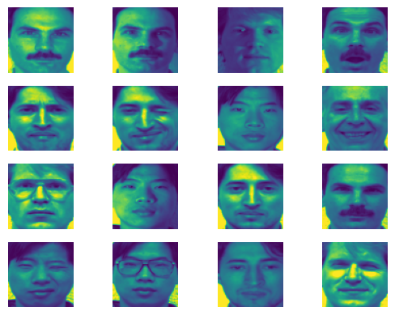
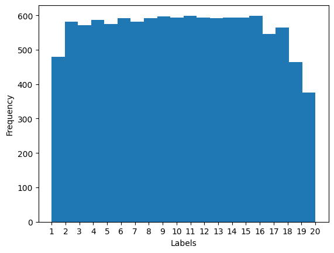
### Problem Formulation

* Define:
  * After pre-processing the images each image will be of size 224x224 and these will be our inputs. Our output will be an embedding
  * Embeddings:
    * As of right now there will be 7 methods that I will test out which are:
      * MDS(multidimensional scaling)
      * Isomap
      * Locally Linear Embedding (LLE)
      * t-distributed Stochastic Neighbor Embedding (t-SNE)
      * LTSA (Local tangent space alignment)
      * Diffusion Maps
      * Variations of Wassmap

  * Each embedding has its own parameters that we will need to tune and we will experiment with different parameter setting to try and get the best clustering performance.
* Yale Face Dataset Embeddings:
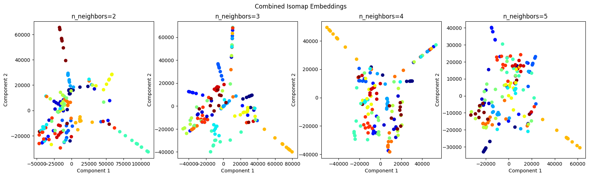
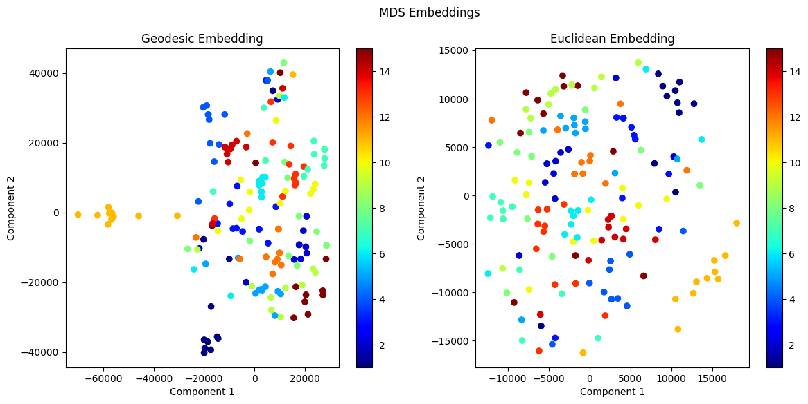
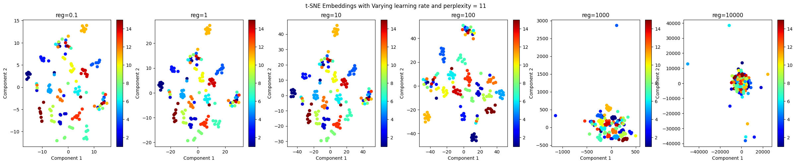

* Newsgroup Embeddings:
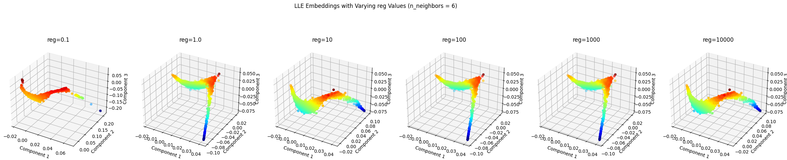
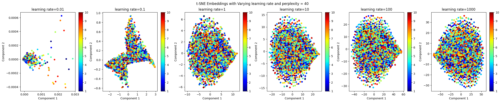

* Wassmap Embedding for Yale Dataset:
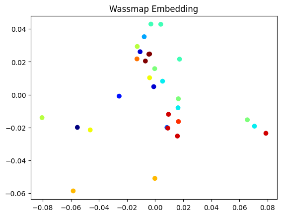

### Performance Comparison

* We will have multiple performance metrics which include:
   * Normalized Mutual Information (NMI)
   * Accuracy
   * F1 Score
   * Adjusted Rand Index (ARI)
     
* Here is an example of what the scores look like for 2 components with isomap embedding:
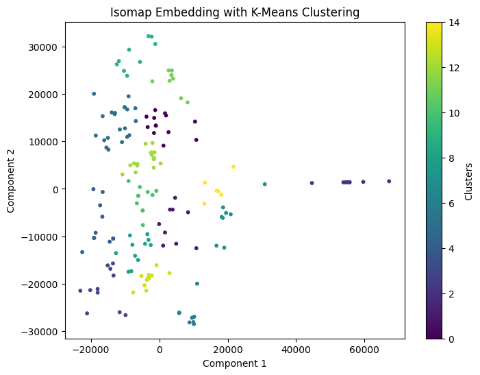

* Here are some graphs looking at the performance for different component values:
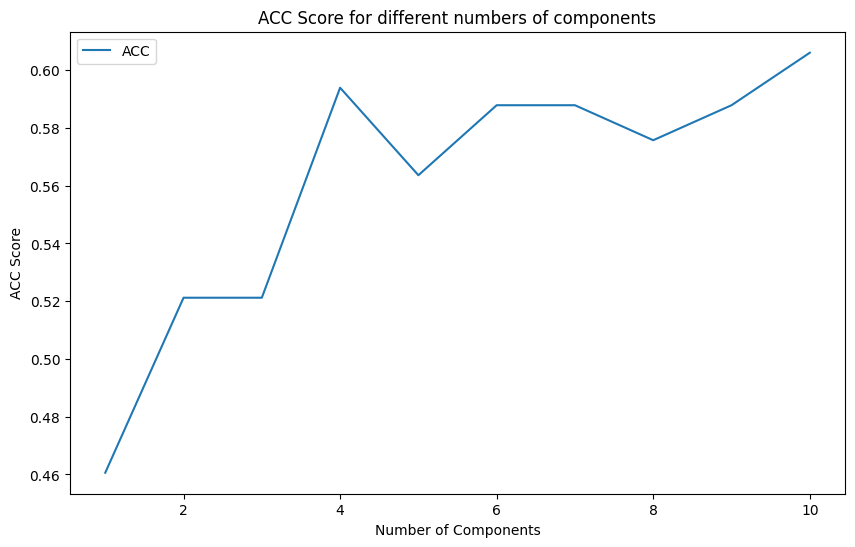
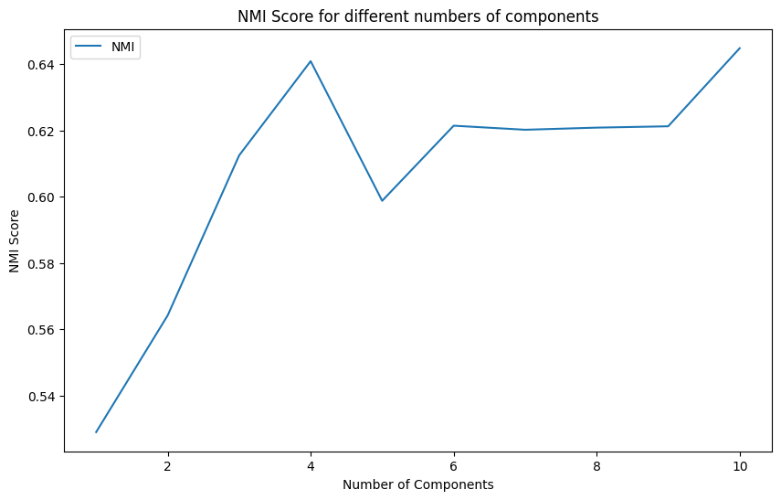

### Conclusions

According to the results we have right now Wassmap based embeddings are performing significantly worse compared to their euclidean counterparts and the runtime and computational cost is much higher than other methods. If I had to make a decision right now as to whether or not optimal transport based embeddings provide more value than euclidean ones I would say no. However there is still more to be done and my code is far from perfect. There could be many reasons as to why their performance scores are so low and I will need to investigate further
  

### Future Work

I would like to see if I can get the performance of Wassmap to be a bit higher on one of the embeddings. I would like to solve the memory issue so that we can run Wassmap on the full resolution and on the full dataset. Solving the memory issue would also allow us to use this technique on a wider array of datasets such as the Newsgroup dataset as I was not able to get a table of results for that particular dataset.

### Data

* http://qwone.com/~jason/20Newsgroups/
* https://www.kaggle.com/datasets/olgabelitskaya/yale-face-database

